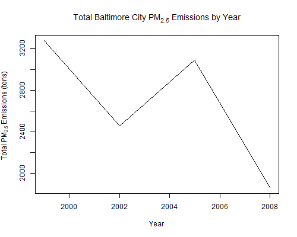
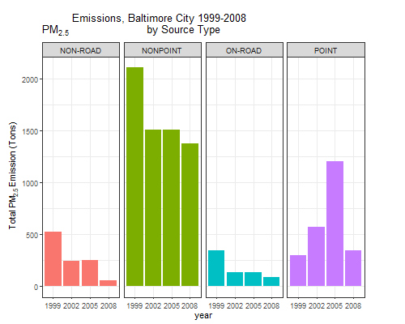
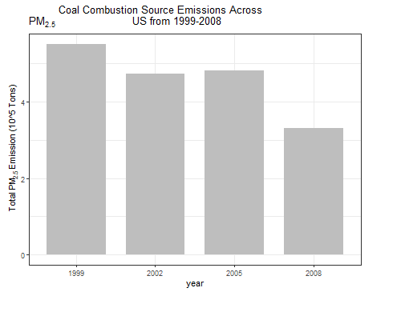
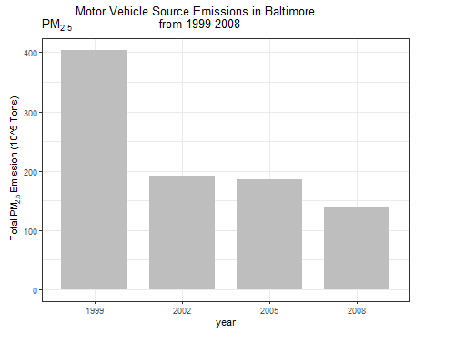
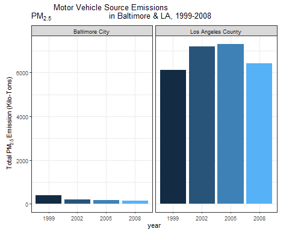

<center>## Exploratory Data Analysis - Course Project 2
<br>
<right>By Sepulveda, Eduardo</right>

### Answers to the questions are at the bottom of this document ### </center>
<br>
We first ensure that the datasets file is extracted and extracted.

```
#Download in packages
library(zip)

#Checking for and creating directories
if(!file.exists("./data2")){dir.create("./data2")}

#Getting data from the internet download.file()
url <- "https://d396qusza40orc.cloudfront.net/exdata%2Fdata%2FNEI_data.zip"
destfile <- paste("./data2", basename(url), sep = "/")
download.file(url = url,
              destfile = destfile,
              mode = "wb")

#unzipping the file
unzip(zipfile = "./data2/exdata%2Fdata%2FNEI_data.zip",
      exdir = "./data2",
      overwrite = TRUE)

```

<br>
<h4>*Question 1*</h4>
First we'll aggregate the total PM2.5 emission from all sources for each of the years 1999, 2002, 2005, and 2008.

```
#Read files
SCC <- readRDS("./data2/Source_Classification_Code.rds")
NEI <- readRDS("./data2/summarySCC_PM25.rds")
```

```
#Calculating total emissions per year PM25
totalPM25year <- tapply(NEI$Emissions, NEI$year, sum)
```
Using the base plotting system, now we plot the total PM2.5 Emission from all sources.

```
#Plot the result
plot(names(totalPM25year), totalPM25year, type = "l",
     xlab = "Year", ylab = expression("Total" ~ PM[2.5] ~ "Emissions (tons)"),
     main = expression("Total US" ~ PM[2.5] ~ "Emissions by Year"))
```


<h5>Response</h5>
*As we can see from the plot, total emissions have decreased in the US from 1999 to 2008.*

Saving the graphic *.png
```
#Copy Plot in png-file
dev.copy(png, filename = 'plot1.png', width = 500, height = 400)
dev.off ()
```

<br>
<h4>*Question 2*</h4>
First we aggregate total emissions from PM2.5 for Baltimore City, Maryland (fips="24510") from 1999 to 2008.

We now load the NEI and SCC data frames from the .rds files.
```
#Reading data
SCC <- readRDS("./data2/Source_Classification_Code.rds")
NEI <- readRDS("./data2/summarySCC_PM25.rds")
```

```
#Fetching data from BaltimoreCity
BaltimoreCity <- subset(NEI, fips == "24510")

#Calculating total emissions per year in the city of Baltimore
totalPM25Baltimoreyear <- tapply(BaltimoreCity$Emissions,
                                 BaltimoreCity$year, sum)
```
Now we use the base plotting system to make a plot of this data.

```
#Plot the result
plot(names(totalPM25Baltimoreyear), totalPM25Baltimoreyear, type = "l",
     xlab = "Year", ylab = expression("Total" ~ PM[2.5] ~ "Emissions (tons)"), 
     main = expression("Total Baltimore City" ~ PM[2.5] ~ "Emissions by Year"))
```



<h5>Response</h5>
*Overall total emissions from PM2.5 have decreased in Baltimore City, Maryland from 1999 to 2008.*

Saving the graphic *.png
```
#Copy Plot in png-file
dev.copy(png, filename = 'plot2.png', width = 500, height = 400)
dev.off ()
```

<br>
<h4>*Question 3*</h3>
Which have seen increases in emissions from 1999–2008?

We now load the NEI and SCC data frames from the .rds files.
```
#Reading data
SCC <- readRDS("./data2/Source_Classification_Code.rds")
NEI <- readRDS("./data2/summarySCC_PM25.rds")
```
Loading Baltimore City data

```
#Load libraries
library(ggplot2)

#Fetching data from BaltimoreCity
BaltimoreCity <- subset(NEI, fips == "24510")
```

Using the ggplot2 plotting system

```
#Calculating total emissions by Typetfor and year BaltimoreCity
#Creating the graph
ggp <- ggplot(BaltimoreCity, aes(factor(year), Emissions, fill=type)) +
  geom_bar(stat="identity") +
  theme_bw() + guides(fill="none")+
  facet_grid(.~type,scales = "free", space="free") + 
  labs(x="year", y=expression("Total PM"[2.5]*" Emission (Tons)")) + 
  labs(title=expression("PM"[2.5]*" Emissions, Baltimore City 1999-2008 
                        by Source Type")) + 
  theme(plot.margin = margin(t = 30,  # Top margin
                             r = 50,  # Right margin
                             b = 5,  # Bottom margin
                             l = 10)) # Left margin

#Viewing the graph
print(ggp)
```



<h5>Response</h5>
*The point source saw a slight increase overall from 1999-2008. Also note that the point source saw a significant increase until 2005 at which point it decreases again by 2008 to just above the starting values.*

Saving the graphic *.png

```
#Copy Plot in png-file
dev.copy(png, filename = 'plot3.png', width = 500, height = 400)
dev.off ()
```
<br>
<h4>*Question 4*</h3>
*Across the United States, how have emissions from coal combustion-related sources changed from 1999–2008?*


We now load the NEI and SCC data frames from the .rds files.
```
#Reading data
SCC <- readRDS("./data2/Source_Classification_Code.rds")
NEI <- readRDS("./data2/summarySCC_PM25.rds")
```
First we subset coal combustion source factors NEI data.

```
#Subset coal combustion related NEI data
combustionRelated <- grepl("comb", SCC$SCC.Level.One, ignore.case=TRUE)
coalRelated <- grepl("coal", SCC$SCC.Level.Four, ignore.case=TRUE) 
coalCombustion <- (combustionRelated & coalRelated)
combustionSCC <- SCC[coalCombustion,]$SCC
combustionNEI <- NEI[NEI$SCC %in% combustionSCC,]
```
Note: The SCC levels go from generic to specific. We assume that coal combustion related SCC records are those where SCC.Level.One contains the substring 'comb' and SCC.Level.Four contains the substring 'coal'.

```
#Creating the graph
ggp <- ggplot(combustionNEI,aes(factor(year),Emissions/10^5)) +
  geom_bar(stat="identity",fill="grey",width=0.75) +
  theme_bw() +  guides(fill=FALSE) +
  labs(x="year", y=expression("Total PM"[2.5]*" Emission (10^5 Tons)")) + 
  labs(title=expression("PM"[2.5]*
                          " Coal Combustion Source Emissions Across
                        US from 1999-2008"))  + 
  theme(plot.margin = margin(t = 20,  # Top margin
                             r = 50,  # Right margin
                             b = 40,  # Bottom margin
                             l = 10)) # Left margin)

#Viewing the graph
print(ggp)
```


<h5>Response</h5>
Emissions from coal combustion related sources have decreased from 6 * 10^6 to below 4 * 10^6 from 1999-2008.
Eg. Emissions from coal combustion related sources have decreased by about 1/3 from 1999-2008!*


Saving the graphic *.png

```
#Copy Plot in png-file
dev.copy(png, filename = 'plot4.png', width = 500, height = 400)
dev.off ()
```

<br>
<h4>*Question 5*</h4>
*How have emissions from motor vehicle sources changed from 1999–2008 in Baltimore City?*

We now load the NEI and SCC data frames from the .rds files.
```
#Reading data
SCC <- readRDS("./data2/Source_Classification_Code.rds")
NEI <- readRDS("./data2/summarySCC_PM25.rds")
```
First we subset the motor vehicles, which we assume is anything like Motor Vehicle in SCC.Level.Two.

```
#Gathering the NEI data subsets that correspond to vehicles
vehicles <- grepl("vehicle", SCC$SCC.Level.Two, ignore.case=TRUE)
vehiclesSCC <- SCC[vehicles,]$SCC
vehiclesNEI <- NEI[NEI$SCC %in% vehiclesSCC,]
```

Next we subset for motor vehicles in Baltimore,
```
#Subset the vehicles NEI data to Baltimore's fip
baltimoreVehiclesNEI <- vehiclesNEI[vehiclesNEI$fips=="24510",]
```
Finally we plot using ggplot2,

```
#Creating the graph
ggp <- ggplot(baltimoreVehiclesNEI,aes(factor(year),Emissions)) +
  geom_bar(stat="identity",fill="grey",width=0.75) +
  theme_bw() +  guides(fill=FALSE) +
  labs(x="year", y=expression("Total PM"[2.5]*" Emission (10^5 Tons)")) + 
  labs(title=expression("PM"[2.5]*" Motor Vehicle Source Emissions in Baltimore
                        from 1999-2008")) + 
       theme(plot.margin = margin(t = 20,  # Top margin
                                  r = 50,  # Right margin
                                  b = 40,  # Bottom margin
                                  l = 10)) # Left margin)

#Viewing the graph
print(ggp)
```


<h5>Response</h5>
Emissions from motor vehicle sources have dropped from 1999-2008 in Baltimore City

Saving the graphic *.png

```
#Copy Plot in png-file
dev.copy(png, filename = 'plot5.png', width = 500, height = 400)
dev.off ()
```
<br>
<h4>*Question 6*</h4>
Compare emissions from motor vehicle sources in Baltimore City with emissions from motor vehicle sources in Los Angeles County

We now load the NEI and SCC data frames from the .rds files.
```
#Reading data
SCC <- readRDS("./data2/Source_Classification_Code.rds")
NEI <- readRDS("./data2/summarySCC_PM25.rds")
```

Comparing emissions from motor vehicle sources in Baltimore City (fips == "24510") with emissions from motor vehicle sources in Los Angeles County, California (fips == "06037")
```
#Gathering the NEI data subsets that correspond to vehicles
vehicles <- grepl("vehicle", SCC$SCC.Level.Two, ignore.case=TRUE)
vehiclesSCC <- SCC[vehicles,]$SCC
vehiclesNEI <- NEI[NEI$SCC %in% vehiclesSCC,]
# Subset the vehicles NEI data by each city's fip and add city name.

  #Baltimore City
vehiclesBaltimoreNEI <- vehiclesNEI[vehiclesNEI$fips=="24510",]
vehiclesBaltimoreNEI$city <- "Baltimore City"

  #Los Angeles City
vehiclesLANEI <- vehiclesNEI[vehiclesNEI$fips=="06037",]
vehiclesLANEI$city <- "Los Angeles County"

#Combining the two subsets with the city name in one data frame
bothNEI <- rbind(vehiclesBaltimoreNEI,vehiclesLANEI)
```
Now we plot using the ggplot2 system
```
#Creating the graph
ggp <- ggplot(bothNEI, aes(x=factor(year), y=Emissions, fill=city)) +
  geom_bar(aes(fill=year),stat="identity") +
  facet_grid(scales="free", space="free", .~city) +
  guides(fill=FALSE) + theme_bw() +
  labs(x="year", y=expression("Total PM"[2.5]*" Emission (Kilo-Tons)")) + 
  labs(title=expression("PM"[2.5]*" Motor Vehicle Source Emissions
                        in Baltimore & LA, 1999-2008"))+ 
  theme(plot.margin = margin(t = 20,  # Top margin
                             r = 40,  # Right margin
                             b = 20,  # Bottom margin
                             l = 10)) # Left margin)

#Viewing the graph
print(ggp)
```


<h5>Response</h5>
Los Angeles County has seen the greatest changes over time in motor vehicle emissions.


```
#Copy Plot in png-file
dev.copy(png, filename = 'plot6.png', width = 500, height = 400)

dev.off()
```


